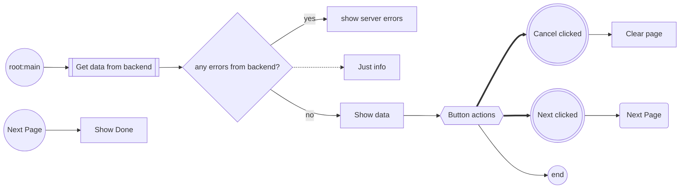

```mermaid
flowchart LR
    start(("root:main"))
    loadData[["Get data from backend"]]
    anyErrors{"any errors from backend?"}
    showErrors["show server errors"]
    justInfo["Just info"]
    showData["Show data"]
    actionButtons{{"Button actions"}}
    cancel((("Cancel clicked")))
    clearPage["Clear page"]
    next((("Next clicked")))
    stop(("end"))
    nextPage("Next Page")
    start --> loadData --> anyErrors -- no --> showData --> actionButtons --> stop
    anyErrors -- yes --> showErrors
    anyErrors -.-> justInfo
    actionButtons ==> cancel --> clearPage
    actionButtons ==> next --> nextPage
    startNextPage(("Next Page"))
    showDone["Show Done"]
    startNextPage --> showDone
```

### Table example
| .My Table |  Value  |
|:----------|:-------:|
| DemoA     |  True   |
| DemoB     |  False  |
