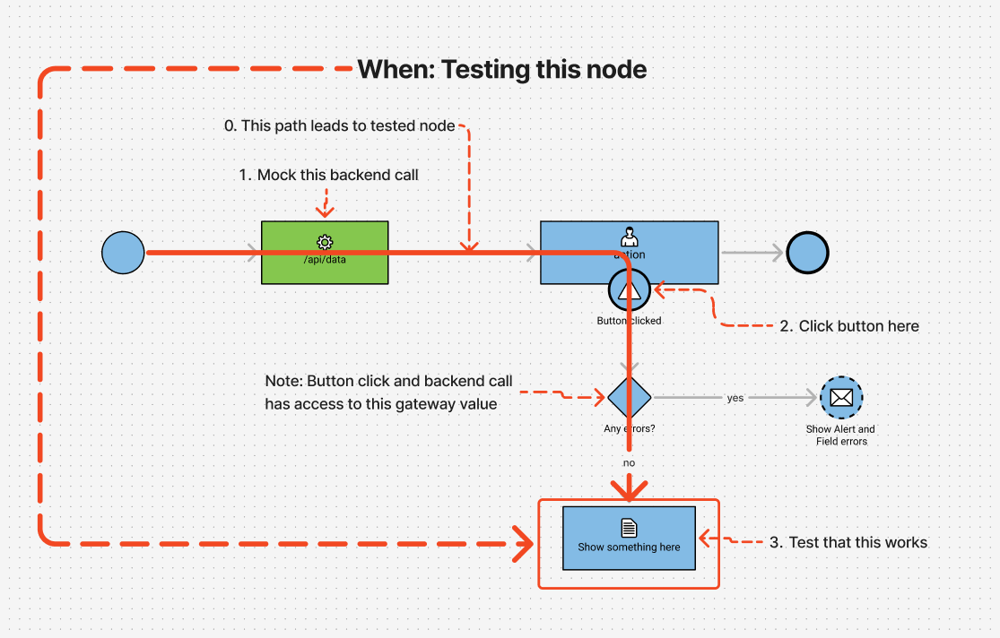

Estridi is a test framework that **automatically generates** test cases for you to implement based on S3D flowcharts.
The purpose of the estridi test framework is to allow test-driven development. By implementing Estridi we will **ensure**
that the requirements documented in the system design actually gets implemented when building the app.

## How does it work?

Before we can get started it is helpful to understand how the test framework traverse our system design in order to find
test cases

###### The path
If we proceed from the picture below, first Estridi identifies a starting node (Learn more on how under "Make your flow testable").
Then it traverse from left to right identifying testable nodes. The test framwork will also always look for the shortest path to the node we
want to test.

###### Testable nodes
- Service calls
- Scipts
- Messages
- Unlinked subflows

In addition to testable nodes we have a few more nodes that you'll have to implement but are not testable.

###### Non testable nodes
- Actions (needs to be implemented)
- Gateways (doesn't need to be implemented)

###### Example below
So if we look at the example picture below we want to the script node called "Show something here".

To get there the test framework will start at our root node to the left. First thing that will happen is that it will identify a service call. In order to get past this node you are going to have to mock this backend call.

After this is mocked you will run into an action node "Button clicked" which also needs to be implemented.

Both these nodes have access to what value the gateway with the name "Any errors?" have and once both are implemented correctly we can test the node we want to test.

  > 

## Summary
To summarize Estridi is a test framework that **automatically generate** tests from system design (S3D). The test framework will always traverse nodes from the root node in the direction of the arrows in a chronological order.
It will always choose the shortest path to the node we want to test (don't worry if you want to make a custom path this is possible but more on that later)

