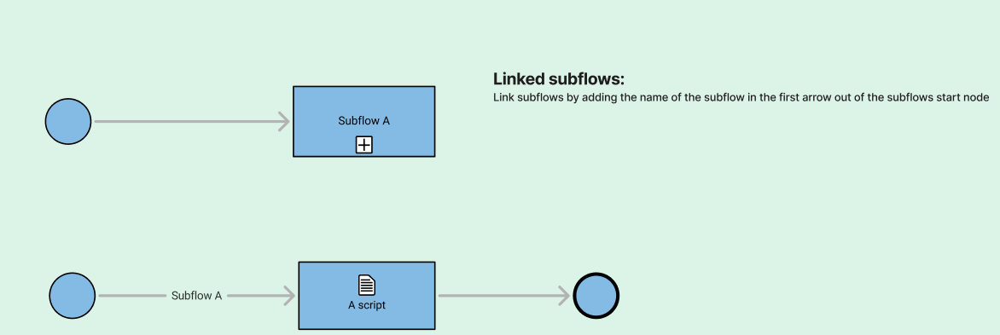

There are a few things that needs to be changed in your S3D flowchart in order to make
your system design testable.

### Add a root node
First you need to create a root node. This is where a test sequence starts.
Create a root node by adding root:[name] to the outgoing arrow from a start node.

  > 

### Link subflows
You can connect a subflow node to the corresponding start node of the subflow.
Connect these nodes by adding the name of the subflow to the outgoing
arrow of the start node in the subflow.

  > 

### Link gateways
There is a possibility that your gateways are contradictory. What this means is that
you can have the **same** gateway in **different** places in your flow and the **state** of that gateways cannot be
for example **yes and no** at the same time.

To avoid this ever happens, gateways that are the same needs to have the **exact** same name.

  > 

### Link scripts
Like the gateway problem above we can have the same problem with scripts. There is a
possibility to have two scripts that are the **same** but the flow cannot be simplified to only use one scripts.

To avoid having duplicated tests that are the same, make sure that scripts that are the same have the **exact** same name.

  > 

### Link subflows to tables
To be able to test tables in your system design we can connect our subflows to the tables.
This is useful to test for example validation or if a field is visible or not. To connect a subflow and
a table the subflow name needs to follow this format:

[Some name]: [Table name]

Example: [Display fields]: [Some table]

Then in the top left cell of your table insert your **exact** table name

  > 

### Custom tests

There are edge cases where custom tests are needed. For example there are some edge cases where you want to **manually**
run an action instead of having it being auto-implemented. This can be useful if you need to do custom actions
between steps to reproduce a specific circumstance. One of these edge cases can for example be producing an
error message and then clearing it and then test if it has been cleared (you are stepping forward and backward in the flow).

To make a node a custom test put _ in front of that node name. In the picture below we have specified that the test with the
name "Clear all alerts and validation errors" is going to be handled as a custom test but putting _ in the beginning.

  > 

### Summary

So as you can see there are a few small changes we need to do in order to make our flow testable.
- Add a root node
- Link our subflows
- Link gateways that are the same
- Link scripts that points to the same testcase
- Identify custom tests

Now you can generate tests from your system design!!!