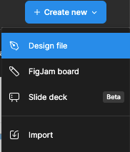
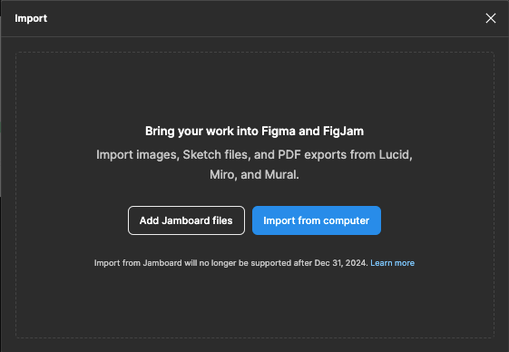
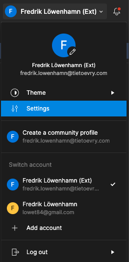
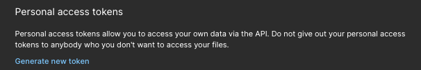
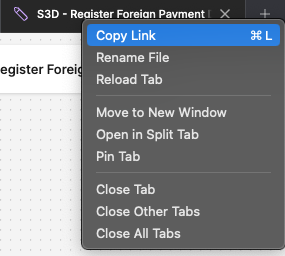

In this tutorial we will create an example application using estridi, Playwright and React with vite.

## S3D flowchart

Start by downloading the .jam file for the example project [here](https://example.com)
Import the jam file into figma.

Click "create new" > "import" > "import from computer"
<div data-lightbox="true">
  > 
</div>

<div data-lightbox="true">
  > 
</div>

## Figma API

Create a user token for your figma account

On the home screen, Click on your user name > Settings
Select the "Security" tab then scroll down to "Personal access tokens" and select "Generate new token"
<div data-lightbox="true">
  > 
</div>

<div data-lightbox="true">
  > 
</div>

Copy the link to the FigJam board
<div data-lightbox="true">
  > 
</div>

The link will look like this:
```url
https://www.figma.com/board/Izz9320atTsGRKo1AjiuxZ/S3D---Register-Foreign-Payment-Draft?node-id=0-1&node-type=canvas&t=4aHwz7RKeCHAvtLf-0
```

This part is the fileId: *Izz9320atTsGRKo1AjiuxZ*


## Create an app

Create a project using:
```bash
npm create vite
```

Follow the instructions in the wizard and choose *React* with *Typescript*

Create a file called "estridi.json" in the root of the project
Copy the token and fileId from the previous steps
```json
{
  "token": "your token here",
  "fileId": "FigJam file Id"
}

```

This will generate your tests

## Playwright

Add a playwright config file
```javascript
// playwright.config.ts
import { defineConfig } from '@playwright/test'

export default defineConfig({
  testDir: './tests',
  fullyParallel: true,
  use: {
    baseURL: 'http://localhost:5173',
    trace: 'on-first-retry'
  },
  webServer: {
    command: 'npm run dev',
    url: 'http:/localhost:5173',
    reuseExistingServer: true
  }
})
```

Run your tests with the following command
```bash
npx playwright test

# You might have to run install first:
npx playwright install
```

## estridi

In the project directory, run the following commands
```bash
npx estridi
```
