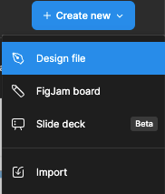
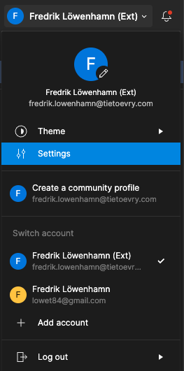
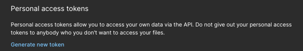
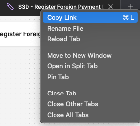
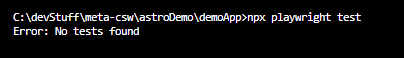

import { FileTree } from '@astrojs/starlight/components';

In this tutorial we will create an example application using estridi, Playwright and React with vite.

## Step 1. Download and open example jamfile
### [Download the .jam file here](/Estridi_Docs.jam)
`Estridi Astro Docs.jam`
<FileTree>
- public
  - **Estridi_Docs.jam**
</FileTree>
To import your .jam file in figma.

Click "create new" > "import" > "import from computer"
<div data-lightbox="true">
  > 
</div>

<div data-lightbox="true">
  > 
</div>

## Step 2. Create an app
Create a project using:
```bash
npm create vite
```
Follow the instructions in the wizard and choose *React* with *Typescript*

#### Install dependencies

After your app is created we need to install a few dependencies. As mentioned earlier we will use Playwright for testing.

```bash
npm install --save-dev estridi@latest
npm install --save-dev playwright@latest
npm install --save-dev @playwright/test
```

Make sure it is the latest version of Estridi in your package.json
```
"^1.0.0-beta117"
```

## Step 3. Configure estridi & playwright

#### Create estridi.json

Create estridi.json in the **root** for you project. As mentioned under "Getting started" section you will need to
add an token and a fileId inside this file.
##### estridi.json
```json
{
  "token": "<my figma user token>",
  "fileId": "<file id of the FigJam board>"
}
```
Create a user token for your figma account

On the home screen, Click on your user name > Settings
Select the "Security" tab then scroll down to "Personal access tokens" and select "Generate new token"
<div data-lightbox="true">
  > 
</div>

<div data-lightbox="true">
  > 
</div>

Copy the link to the FigJam board
<div data-lightbox="true">
  > 
</div>

The link will look like this:
```
https://www.figma.com/board/Izz9320atTsGRKo1AjiuxZ/S3D---Register-Foreign-Payment-Draft?node-id=0-1&node-type=canvas&t=4aHwz7RKeCHAvtLf-0
```

This part is the fileId: *Izz9320atTsGRKo1AjiuxZ*

#### Create playwright.config.ts
We also need to configure our playwright tests. Create a file called `playwright.config.ts` in the root of your project.

Add a playwright config file
```javascript
// playwright.config.ts
import { defineConfig } from '@playwright/test'

const baseURL = 'http://localhost:5173'
export default defineConfig({
  testDir: './tests',
  use: {
    baseURL,
    trace: 'on-first-retry'
  },
  webServer: {
    command: 'npm run dev',
    url: baseURL,
    reuseExistingServer: true
  }
})
```
#### Try and run playwright
Now you should be able to run playwright by running the following command:
```bash
npx playwright test
```

And hopefully you will get something like this. Because we do not have any tests yet.playwright
<div data-lightbox="true">
  > 
</div>

## Step 4. Generate tests
First make your system design (flow) testable by adding a root node. More on how under "Make your flow testable".

Then we need to add a script to run estridi. In you package.json add a new script called estridi.
```json
{
  "scripts": {
    "estridi": "estridi"
  }
}
```

Run the script by running:
```bash
npm run estridi
```

And if everything went well you should see a new directory called `tests` with a file called `main.spec.ts`.

##### Now we are ready to start testing!!!


