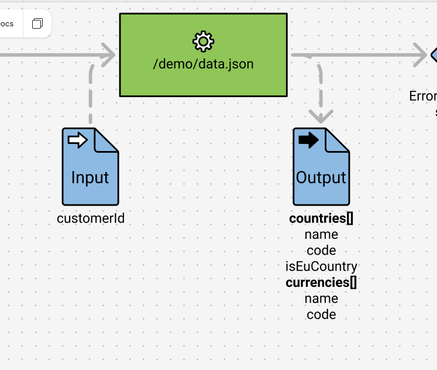

import { FileTree } from '@astrojs/starlight/components';

## Step 1. Create main.ts
First we need to create our handles file called main.ts. This is where we are going to implement our tests.

<FileTree>
  - tests
    - **main.ts**
    - main.handles.ts
</FileTree>

In your `main.ts` file copy and paste following code below.

```typescript
import {Main} from './main.spec.js'

export const handles: Main = {
    setup: async function () {
        return {}
    },
    start: async function ({page}) {
        await page.goto('/index.html')
    },
}
```

Now we have done the setup to be able to run out tests.

#### How to work with this
So you are going to have to keep track of two files.
<FileTree>
  - tests
    - main.ts *This is where you run your tests*
    - main.handles.ts *This is where you implement your tests*
</FileTree>

So to clarify `main.ts` is auto-generated and everytime you run estridi this file will be re-generated. So **do not** write any code here. This file is only for running the tests.
The other file`main.handles.ts` is where you get to write code and actually implement your tests.

## Step 2. Implement your first tests

In your spec file you will find a test that looks like this:

```typescript
 test('demo data json', async ({ page, context }) => {
    const gateways: GatewayCollection = {}
    const state = await handles.setup({ gateways, page, context } as any)
    const args = { gateways, state, page, context } as any
    await handleServiceCalls(args)
    await handles.start(args)

    await handles.test_demoDataJson(args)
  })
```

When you try to run it you will probably run into something like this:
<div data-lightbox="true">
  > 
</div>

This is because we have not implemented the test yet. So let's do that.


#### Implement service call
In your `main.handles.ts` start typing servic... and hopefully you will get a suggestion to implement the test.

```typescript
   serviceCall_demoDataJson: async ({context, gateways}) => {

    },
```

We are also going to import two functions from @playwright/test.
```typescript
import {expect, Route} from "@playwright/test";
```

According to our system design we want to make a service call and get back a list of countries with the properties "name", "code" and a boolean "isEUCountry".
And if we get any error from the call we want to throw an error, for example status 500.
We are going to utilize the "Route" function from @playwright/test. Your can read more about the function [here!!!](https://playwright.dev/docs/api/class-route 'Click me!')
<div data-lightbox="true">
  > 
</div>
So let's implement the test.

```typescript
    serviceCall_demoDataJson: async ({context, gateways}) => {
        await context.route('/demo/data.json', async (route: Route) => {
            await route.fulfill(gateways['Errors from data service'] === 'yes' ?
                {status: 500} :
                {
                    status: 200,
                    json: {
                        countries: [{
                            name: 'Sweden',
                            code: 'SE',
                            isEuCountry: true
                        },
                            {
                                name: 'Japan',
                                code: 'JP',
                                isEuCountry: false
                            }],
                    },
                })
        })
    },
```

So first we route to our demo API and then we check if we have any errors from the data service. If we do we throw an error with status 500.
If we do not have any errors we return a list of countries with the properties "name", "code" and "isEUCountry".

##### Good job! Now you have implemented the service call!!

## Step 3. Implement the app

As you may have noticed if you run the test again it will still fail. This is because we have not implemented the app yet.
So in our app we need to fetch from our API and then if we get any error we want to return status 500. Exactly as our tests are expecting.
Doing the test first and then implementing the app is what we call TDD (Test Driven Development).
