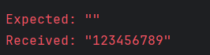

import { FileTree } from '@astrojs/starlight/components';

## Step 1. Create main.ts
First we need to create our handles file called main.ts. This is where we are going to implement our tests.

<FileTree>
  - tests
    - **main.ts**
    - main.spec.ts
</FileTree>

In your `main.ts` file copy and paste following code below.

```typescript
import {Main} from './main.spec.js'

export const handles: Main = {
    setup: async function () {
        return {}
    },
    start: async function ({page}) {
        await page.goto('/index.html')
    },
}
```

Now we have done the setup to be able to run out tests.

#### How to work with this
So you are going to have to keep track of two files.
<FileTree>
  - tests
    - main.ts *This is where you implement your tests*
    - main.spec.ts *This is where you run your tests*
</FileTree>

So to clarify `main.spec.ts` is auto-generated and everytime you run estridi this file will be re-generated. So **do not** write any code here. This file is only for running the tests.
The other file`main.ts` is where you get to write code and actually implement your tests.

## Step 2. Implement your first tests

In your spec file you will find a test that looks like this:

```typescript
 test('demo data json', async ({ page, context }) => {
    const gateways: GatewayCollection = {}
    const state = await handles.setup({ gateways, page, context } as any)
    const args = { gateways, state, page, context } as any
    await handleServiceCalls(args)
    await handles.start(args)

    await handles.test_demoDataJson(args)
  })
```

When you try to run it you will probably run into something like this:
<div data-lightbox="true">
  > 
</div>

This is because we have not implemented the test yet. So let's do that.


#### Implement service call
In your `main.ts` start typing servic... and hopefully you will get a suggestion to implement the test.

```typescript
   serviceCall_demoDataJson: async ({context, gateways}) => {

    },
```

We are also going to import two functions from @playwright/test.
```typescript
import {expect, Route} from "@playwright/test";
```

According to our system design we want to make a service call and get back a list of countries with the properties "name", "code" and a boolean "isEUCountry".
And if we get any error from the call we want to throw an error, for example status 500.
We are going to utilize the "Route" function from @playwright/test. Your can read more about the function [here!!!](https://playwright.dev/docs/api/class-route 'Click me!')
<div data-lightbox="true">
  > 
</div>
So let's implement the service call.

```typescript
    serviceCall_demoDataJson: async ({context, gateways}) => {
        await context.route('/demo/data.json', async (route: Route) => {
            await route.fulfill(gateways['Errors from data service'] === 'yes' ?
                {status: 500} :
                {
                    status: 200,
                    json: {
                        countries: [{
                            name: 'Sweden',
                            code: 'SE',
                            isEuCountry: true
                        },
                            {
                                name: 'Japan',
                                code: 'JP',
                                isEuCountry: false
                            }],
                    },
                })
        })
    },
```

So first we route to our demo API and then we check if we have any errors from the data service. If we do we throw an error with status 500.
If we do not have any errors we return a list of countries with the properties "name", "code" and "isEUCountry".

##### Good job! Now you have implemented the service call!!
##### Next we need to implement the actual test
## Step 3. Implement service call test
So this can be a bit tricky at the beginning but try to imagine what we want to happen when we do our service call.
Of course we have not implemented it yet but we want it to respond with https code 200 which means that everything is ok.
So lets test that!

In your `main.ts` file start typing test... and you should get a suggestion to implement the test.

```typescript
    test_demoDataJson: async function ({page}) {
          await expect(page.locator('body')).toBeVisible() // This is just to make sure that the page is loaded
          const [response] = await Promise.all([
              page.waitForResponse('/localMock/countries.json'),
              page.reload()
          ])
          expect(response.status()).toBe(500)
      },
```
If you have been attentive you may have noticed that we are expecting status 500 which is NOT what we want. We want status 200.
But it is good practice to invert the test and see that it actually fails. And then when we change it to 200 we can see that it passes.

##### So now the test is done!! Time to implement the app so our test passes!
## Step 4. Implement the app

As you may have noticed if you run the test again it will still fail. This is because we have not implemented the app yet.
So in our app we need to fetch from our API and then if we get any error we want to return status 500. Exactly as our tests are expecting.
Doing the test first and then implementing the app is what we call TDD (Test Driven Development).

In your app remove everything so you have an empty app

```typescript
import React, {useEffect, useState} from 'react';

function App() {

    return (
        <>
           DEMO!!!
        </>
    )
}

export default App;
```

Remember to start your app by running `npm run dev`.

Now we can implement our "mocked" service call in our app.

```typescript
   type Country = {
        name: string
        code: string
        isEuCountry: boolean
    }
    const [countries, setCountries] = useState<Country[]>([])

    useEffect(() => {
        fetch('/localMock/countries.json')
            .then((res) => {
                if (!res.ok) throw new Error('Failed to fetch countries')
                return res.json()
            })
            .then((res) => setCountries(res.countries))
            .catch((error) => console.error(error))
    }, [])
```

Then in our public directory create a new folder called `localMock` and in that folder create a file called `countries.json`.

```json
{
  "countries": [
    {
      "name": "Sweden",
      "code": "SE",
      "isEuCountry": true
    },
    {
      "name": "Japan",
      "code": "JP",
      "isEuCountry": false
    }
  ]
}
```
Should look something like this:

<FileTree>
  - public
    - localMock
        - **countries.json**
    - vite.svg
  - src
    - App.tsx
</FileTree>

## Step 5. Make your first test pass!

First make sure your "mock" works by going to `http://localhost:XXXX/localMock/countries.json` and you should see the json file.
<div data-lightbox="true">
  > 
</div>
<div data-lightbox="true">
  > 
</div>

Now it is time to run our test:
<div data-lightbox="true">
  > 
</div>

And hopefully you will see that the test failed because:
<div data-lightbox="true">
  > 
</div>
And that is because our test looks like this:
```typescript
    test_demoDataJson: async function ({page}) {
          await expect(page.locator('body')).toBeVisible() // This is just to make sure that the page is loaded
          const [response] = await Promise.all([
              page.waitForResponse('/localMock/countries.json'),
              page.reload()
          ])
          expect(response.status()).toBe(500) //we are expecting 500 but we want 200
      },
```

And this is **good** because as mentioned before we want to invert the test and see that it fails. So let's change it to 200 and run the test again.
<div data-lightbox="true">
  > 
</div>

##### Good job!!! You have now implemented your first test and made it pass!!!
##### Welcome to test driven development!!!
