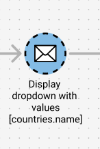
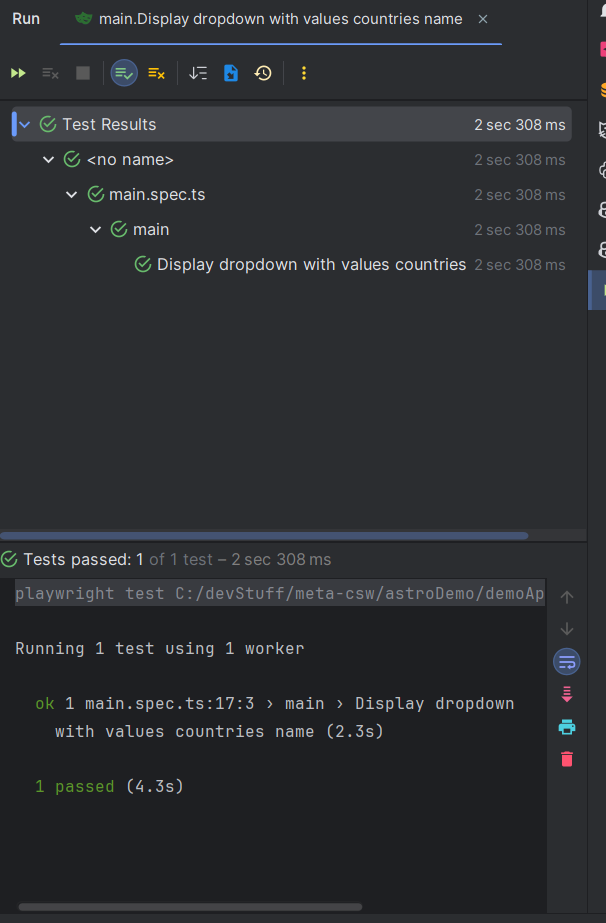
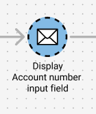
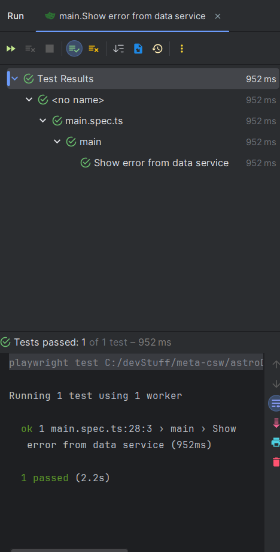
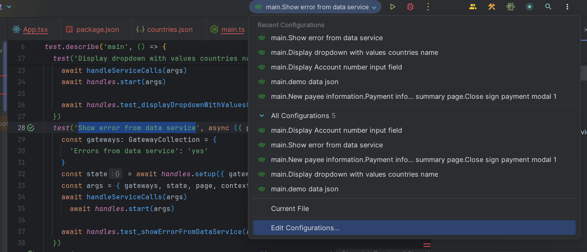
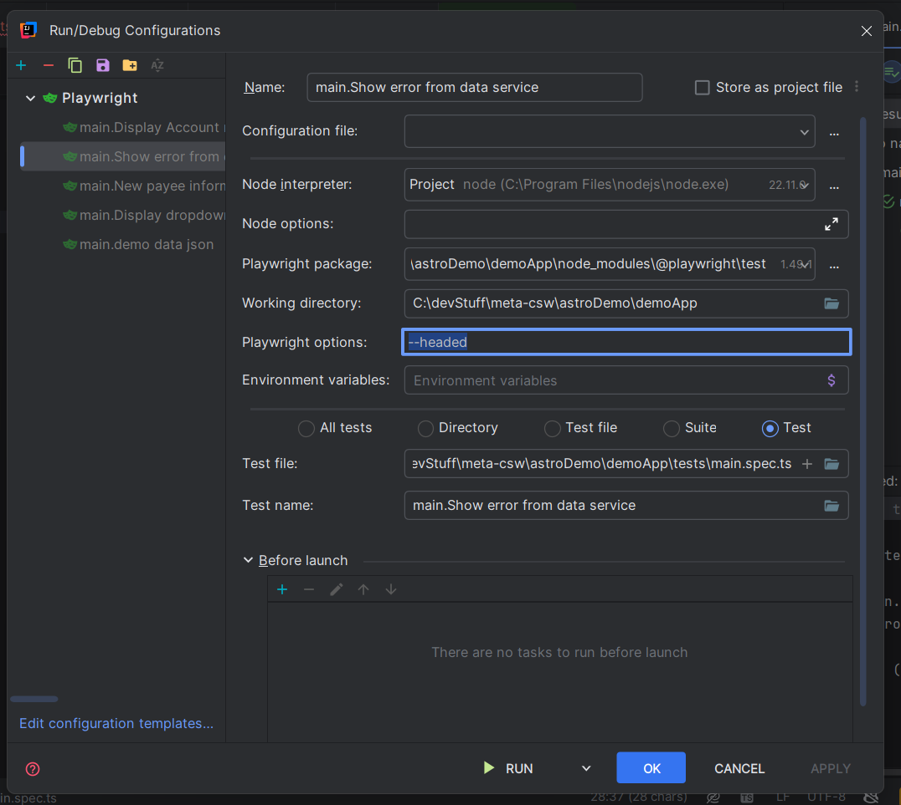
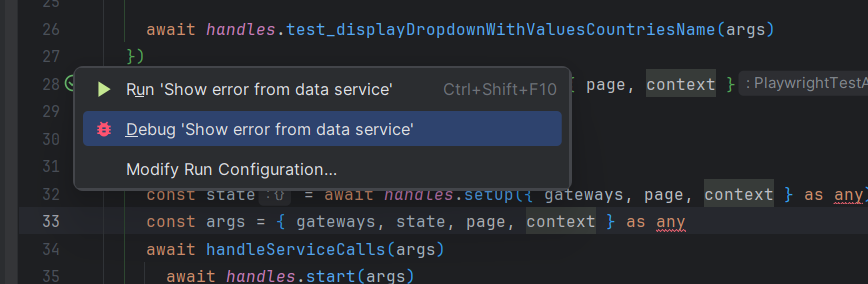
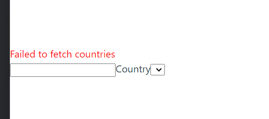

import { FileTree } from '@astrojs/starlight/components';

## Step 1. Implement display dropdown test
So in previous test we tested a service call. Now it is time to test the GUI. Working test driven we **always** want to implement the test before the APP.

According to our figma design the next node to test is this one:
<div data-lightbox="true">
  > 
</div>

So lets implement the test
```typescript
 test_displayDropdownWithValuesCountriesName: async function ({page}) {

    },
```

In this test we want to test that we display a dropdown that is populated with the country names we fetched previously.
```typescript
await expect(page.getByLabel('Country').locator('option', {hasText: 'Sweden'}),).toBeAttached()
```
So in our test we try to find our dropdown by its label, in this case "Country". Then we expect that an option in the dropdown with the text "Sweden" is attached.

If you try to run your test now it will still fail because we have not implemented the APP yet, so lets do that!

## Step 2. Implement the APP

In our App.tsx remove "DEMO".
So lets implement our dropdown, there are many different ways you can do this. Here is one example:
```typescript
       <div>
            <label htmlFor="country-dropdown">Country</label>
            <select id="country-dropdown">
                {countries.map((country) => (
                    <option key={country.code} value={country.code}>
                        {country.name}
                    </option>
                ))}
            </select>
        </div>
```
## Step 3. Run test
Hopefully now you will see that your test passes!

<div data-lightbox="true">
  > 
</div>

##### Good job!
## Step 4. Implement next test
Lets move on!
According to our figma design the next node to test is this one:
<div data-lightbox="true">
  > 
</div>

So this time we want to test if an element is visible. We are going to use the getByTestId to locate our element
```typescript
test_displayAccountNumberInputField: async function ({page}) {
    await expect(page.getByTestId('input-account-number')).toBeVisible()
},
```
## Step 5. Implement the GUI
Now we want to implement this in our App.tsx
```typescript
   return (
        <div>
            <input data-testid='input-account-number'></input> //HERE!!!!
            <label htmlFor="country-dropdown">Country</label>
            <select id="country-dropdown">
                {countries.map((country) => (
                    <option key={country.code} value={country.code}>
                        {country.name}
                    </option>
                ))}
            </select>
        </div>
    )
```

Make sure you try to run the test after and see if it passes, also remember to invert the test to see that it does not pass!!!

## Step 6. Error handling service calls
As you may have noticed we have skipped the test *test_showErrorFromDataService* so lets implement that!

If you remembered in our service call we have already prepared for this test:
```typescript
    serviceCall_demoDataJson: async ({context, gateways}) => {
        await context.route('/localMock/countries.json', async (route: Route) => {
            await route.fulfill(gateways['Errors from data service'] === 'yes' ?
                {status: 500} :
                {
                    status: 200,
                    json: {
                        countries: [{
                            name: 'Sweden',
                            code: 'SE',
                            isEuCountry: true
                        },
                            {
                                name: 'Japan',
                                code: 'JP',
                                isEuCountry: false
                            }],
                    },
                })
        })
    },
```

More specific here:
```typescript
{status: 500}
```

We check that if the gateway *Errors from data service* has the value *yes* we return status *500*. So lets start implementing the test!!

```typescript
test_showErrorFromDataService: async function ({page}) {
    await expect(page.locator('[data-testid="error-message"]')).toHaveText('Failed to fetch countries')
}
```
Here we are trying to locate *[data-testid="error-message"]* and expects it to have the text "Failed to fetch countries".

If you try to run the test now you will see that it fails. So lets implement the app!

First we need to add a useState to store our error somewhere. We also need to change our useEffect to be able to handle errors.

Keep in mind that this is only for demo purposes and in an actually app the error handling is likely to look different.
```typescript
    const [error, setError] = useState<string | null>(null);


    useEffect(() => {
        fetch('/localMock/countries.json', {headers: {customerId: '123456789'}})
            .then(async (res) => {
                if (!res.ok) throw new Error('Failed to fetch countries')
                return res.json()
            })
            .then((res) => setCountries(res.countries))
            .catch((error) => setError(error.message))
    }, [])
```

We also need to print out any error if we get them, so don't forget to do that

```typescript
    return (
        <div>
            {error && (    //HERE
                <div data-testid="error-message" style={{ color: 'red' }}>
                    {error}
                </div>
            )}
            <input data-testid='input-account-number'></input>
            <label htmlFor="country-dropdown">Country</label>
            <select id="country-dropdown">
                {countries.map((country) => (
                    <option key={country.code} value={country.code}>
                        {country.name}
                    </option>
                ))}
            </select>
        </div>
    )
```
Keep in mind that the data-testid needs to be the same as we have in our test in order for us to find the element.

```typescript
<div data-testid="error-message" style={{ color: 'red' }}>
```
```typescript
await expect(page.locator('[data-testid="error-message"]')).toHaveText('Failed to fetch countries')
```

Hopefully now if you run the test "Show error from data service" you will see that it passes.
<div data-lightbox="true">
  > 
</div>

**In next step we will show you how to run tests headed, if run this test headed you will be able to see the error message that pops up**

## Step 7. Run test headed

If you run a test in headed mode playwright will start a browser so that you can see what is happening.

To do that we want to edit the configurations for our test. Make sure it is the correct test you are editing the configurations for.
<div data-lightbox="true">
  > 
</div>

Then in our configurations we want to add **--headed** in our playwright options. Press "apply" and "ok".
```
--headed
```
<div data-lightbox="true">
  > 
</div>

Then in our test we can add a debugger so that the tests stops at our debugger
```typescript
    test_showErrorFromDataService: async function ({page}) {
        await expect(page.locator('[data-testid="error-message"]')).toHaveText('Failed to fetch countries')
        debugger
    }

```

Then we want to debug our test
<div data-lightbox="true">
  > 
</div>

Now you will see that a browser is opening and you will see something like this
<div data-lightbox="true">
  > 
</div>

**Good job!!!**

Now you know how to run your tests headed and how to test error handling from service calls!!!