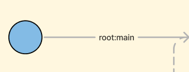
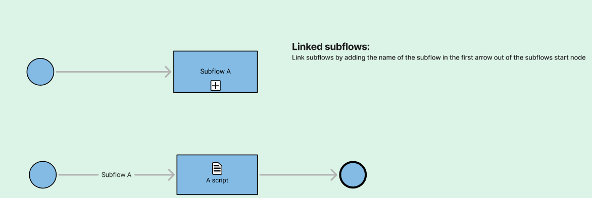
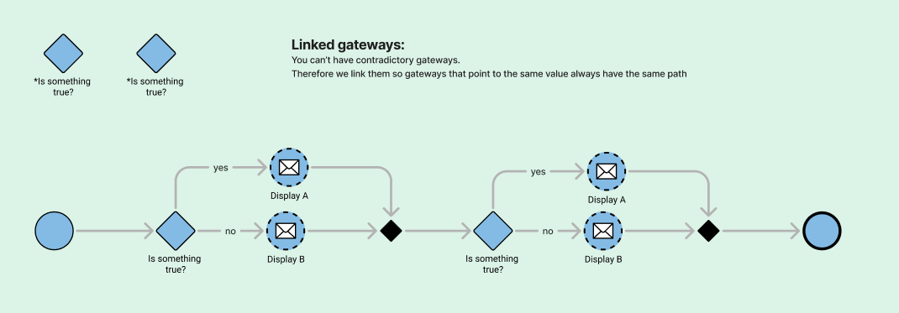

There are a few things that needs to be changed in your S3D flowchart in order to make
your system design testable.

### Add a root node
First you need to create a root node. This is where a test sequence starts.
Create a root node by adding root:[name] to the outgoing arrow from a start node.

> 

### Link subflows
You can connect a subflow node to the corresponding start node of the subflow.
Connect these nodes by adding the name of the subflow to the outgoing
arrow of the start node in the subflow.

> 

### Link gateways
There is a possibility that your gateways are contradictory. What this means is that
you can have the **same** gateway in **different** places in your flow and the **state** of that gateways cannot be
for example **yes and no** at the same time.

To avoid this ever happens, gateways that are the same needs to have the **exact** same name.

> 

### Link scripts
Like the gateway problem above we can have the same problem with scripts. There is a
possibility to have two scripts that are the **same** but the flow cannot be simplified to only use one scripts.

To avoid having duplicated tests that are the same, make sure that scripts that are the same have the **exact** same name.

> 

### Link subflows to tables

