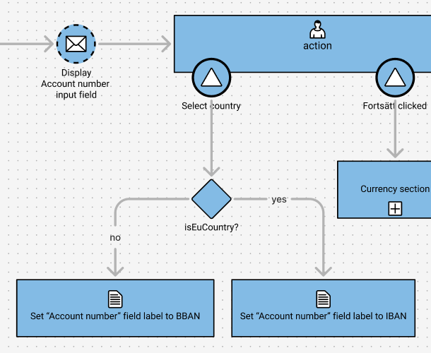

## Step 1. Implement an action
Now it is time to implement an action node. If we take a look a the next testable node in your figma design you will see that in order for us to test that node we need to implement an action.

  > 

